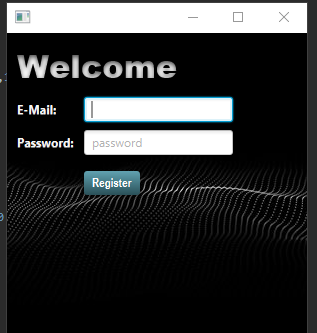
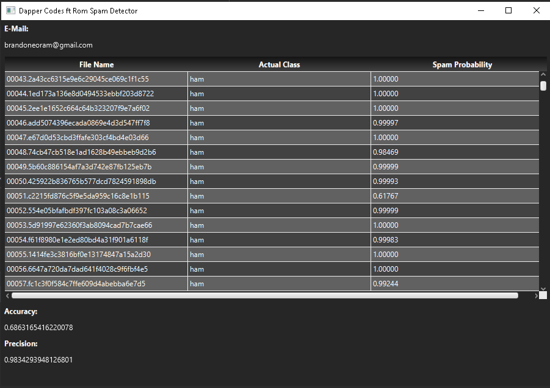

# Spam Detector D:
## _Remove Your Dirty Spam_


Spam Detector will detect your spam!




## Features

- Import a training folder to train the Spam Detector
- Import a testing folder to test out the Spam Detector Program
- Find the accuarcy and precision of each dataset (E-Mail)

Spam Detector is a program that uses datasets of E-Mails to train the program to recognize whether or not new E-Mails are spam. The basis of this training and testing model is using [Naive Bayes spam filtering] and [Bag-of-words model] techniques.

## Improvements
Using more E-Mail datasets containing spam can improve the machine learning process of the program. This will imrpove the precision and accuracy of the model. merging Ham 2 from train/ham2 will increase the accuracy and precision of the spam detection as well.

## Modifications
Changed the TestFile constructor and added getters and setters for those new variables. Added a login UI with CSS to improve aesthetics. 

## Steps to clone application

1. Add train directory to Assignment_Javafx/src/sample/ containg ham and spam.
2. Using TrainingFile.java it will train the program for spam detection and will output the trainHamFreq and trainSpam freq, as well as the probabilities for use of the testing.

### Training

```sh
javac TrainingFile.java
java tranFile <train/ham> <train/spam>
```

### Testing

```sh
javac TestingFile.java
java testFile <PrSW_i.txt> <test/ham> <test/spam>
```

3. Test a new dataset of E-Mails spam and ham using our training model before, that is the probability map
4. You can either run TestFile.java to find the probabilties that a file is spam as a txt output or run it with JavaFX, for the UI table.


[//]: # (These are reference links used in the body of this note and get stripped out when the markdown processor does its job. There is no need to format nicely because it shouldn't be seen. Thanks SO - http://stackoverflow.com/questions/4823468/store-comments-in-markdown-syntax)
   [Naive Bayes spam filtering]: <https://en.wikipedia.org/wiki/Naive_Bayes_spam_filtering>
   [Bag-of-words model]: <https://en.wikipedia.org/wiki/Bag-of-words_model>

